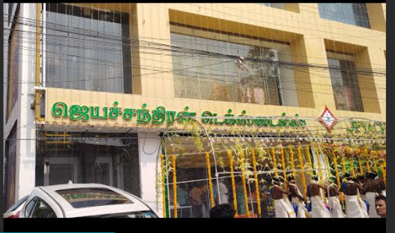

# Ex04 Places Around Me
## Date: 23.09.2025

## AIM
To develop a website to display details about the places around my house.

## DESIGN STEPS

### STEP 1
Create a Django admin interface.

### STEP 2
Download your city map from Google.

### STEP 3
Using ```<map>``` tag name the map.

### STEP 4
Create clickable regions in the image using ```<area>``` tag.

### STEP 5
Write HTML programs for all the regions identified.

### STEP 6
Execute the programs and publish them.

## CODE
```
<!DOCTYPE html>
<html lang="en">
<head>
    <meta charset="UTF-8">
    <meta name="viewport" content="width=device-width, initial-scale=1.0">
    <title>Document</title>
</head>
<body>
    <!-- Image Map Generated by http://www.image-map.net/ -->


<map name="image-map">
    <area target="" alt="JEYACHANDRAN" title="JEYACHANDRAN" href="jeyachandran.html" coords="108,420,455,580" shape="rect">
    <area target="" alt="SWEGESTI DESIGN ZENTRUM" title="SWEGESTI DESIGN ZENTRUM" href="swegesti design zentrum.html" coords="237,734,133" shape="circle">
    <area target="" alt="FORD GLOBAL TECHNOLOGY" title="FORD GLOBAL TECHNOLOGY" href="ford global technology.html" coords="902,806,1232,676" shape="rect">
</map>
</body>
</html>
```

## OUTPUT





## RESULT
The program for implementing image maps using HTML is executed successfully.
